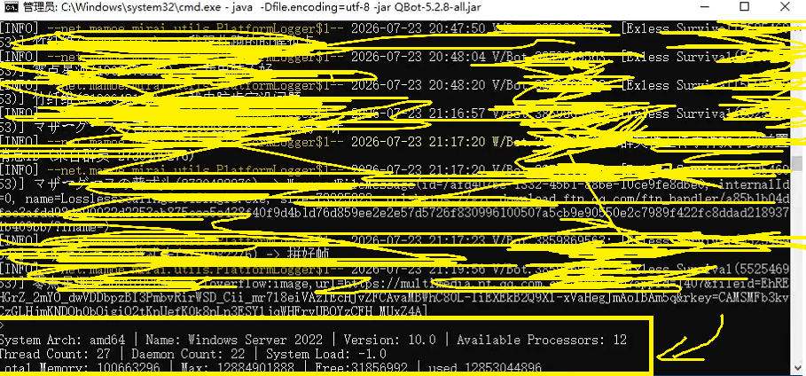

# Monitor

> This function will not take effect as a friendly fallback when your application is running in a non-interactive environment (like a CI server or with redirected input/output)

Monitor is a class that shows the current running status. When you set `conopt4j.monitor.use` to true in the property file mentioned in [Launcher](./docs/Launcher.md), it will start automatically when `Launcher.init()` is called.

The data in the Monitor <small>status</small> part will refresh at a certain frequency based on the `conopt4j.status.interval` setting

>  See [Launcher](./docs/launcher.md)

Here is an example of what it is like:

